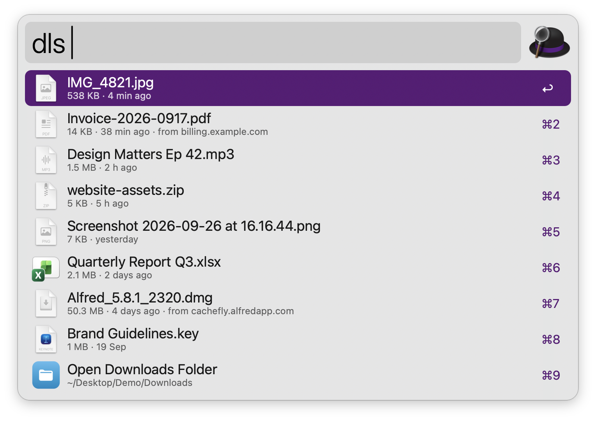
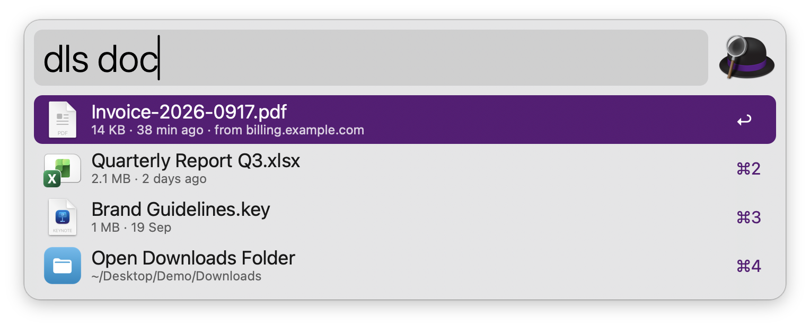
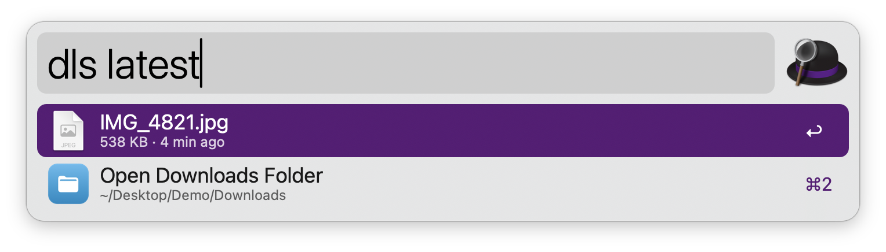

#  Downloads

Browse your Downloads folder in Alfred, newest first, and open, reveal, copy, paste or trash files without opening Finder. No dependencies: everything runs on tools that ship with macOS.

## Usage

See your downloads, newest first, via the `dls` keyword. Files are sorted by the date they were added to the folder, like Finder’s Downloads stack, so an old file you just downloaded still comes first. Each row shows the size, how long ago it arrived and the website it came from. Type to search by name: letters only need to appear in order, and accents are ignored.



* <kbd>↩</kbd> Open the file.
* <kbd>⌘</kbd><kbd>↩</kbd> Reveal in Finder.
* <kbd>⌥</kbd><kbd>↩</kbd> Move to the Trash.
* <kbd>⌃</kbd><kbd>↩</kbd> Copy the file to the clipboard, ready to paste into Finder, Mail or a chat.
* <kbd>fn</kbd><kbd>↩</kbd> Paste the file into the frontmost app.
* <kbd>⌘</kbd><kbd>⌥</kbd><kbd>↩</kbd> Copy the address the file was downloaded from.
* <kbd>⌘</kbd><kbd>C</kbd> Copy the path.
* <kbd>⌘</kbd><kbd>Y</kbd> Quick Look.

Results are real files, so <kbd>→</kbd> shows Alfred’s file actions (Move To, Copy To, Open With, Compress…) and the File Buffer works on several downloads at once.

After moving a file to the Trash, the list comes back so you can keep tidying up. Files in the Trash can be put back from Finder.

### Filters

Type a filter after the keyword to see one kind of file, then optionally a search, like `dls pdf invoice`:

* `img` images, `pdf` PDFs, `doc` documents and spreadsheets.
* `zip` archives, `dmg` disk images, installers and apps.
* `video`, `audio`, `folder`.
* `today`, `yesterday`, `week`, `month` for recent downloads.
* `latest` for the most recent finished download.

Filters combine: `dls img today`.



### Latest Download

Configure the Hotkey to show the most recent finished download, then press <kbd>↩</kbd> to open it or use any modifier above. Unfinished downloads are skipped. The same list appears via the `dls latest` keyword.



### In-progress and iCloud Files

Downloads still in progress in Safari, Chrome, Edge, Brave, Firefox or Opera are marked “Downloading…” and the list refreshes on its own while they grow. <kbd>↩</kbd> reveals them instead of opening a half-finished file. Files stored only in iCloud are marked, and <kbd>↩</kbd> starts downloading them.

### Configuration

In the Workflow’s Configuration you can choose another folder to list, sort by date modified or created instead of date added, include files in subfolders, and show hidden files. Cleaning up old downloads is left to a dedicated workflow.

Every keyword can be changed in the Workflow’s Configuration.

## Development

```bash
swift tools/make_icons.swift tools/icons.json src   # regenerate icons
python3 tools/build.py --package                     # write src/info.plist and dist/*.alfredworkflow
python3 tests/test_downloads.py                      # run the tests
```

## AI disclosure

This workflow was developed with the help of Claude (Anthropic), an AI assistant. The code is reviewed and tested by the author.
